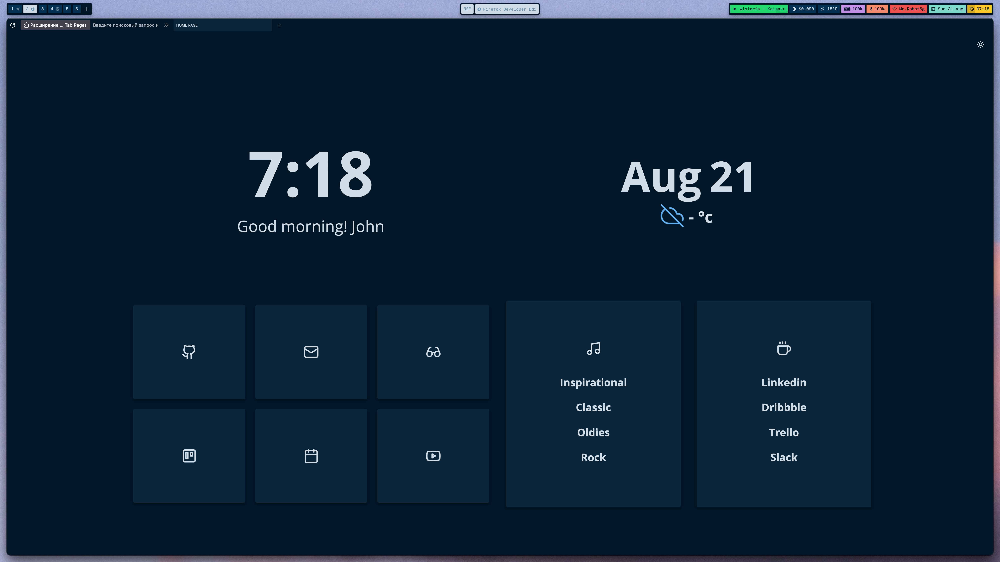

# Bento Night Owl

It's just a customization of the popular [Bento startpage ❤️](https://github.com/migueravila/Bento)

What I've done:
1. [x] Page design in Night Owl colors
2. [x] Added picker to support custom styles
3. [x] Made dockerfile and docker-compose more flexible. They can now run this custom theme

## Usage

```bash
# Clone repo
$ git clone git@github.com:mdwitr0/bento-night-owl.git
# Open folder
$ cd ./bento-night-owl

# Install the dependencies and build the project
$ yarn
$ yarn build 

# Start the local server
$  docker-compose up -d
```

Install `http://localhost:8888 ` as a start page in your browser. You can get more information about the settings by reading the [Bento documentation](https://github.com/migueravila/Bento)